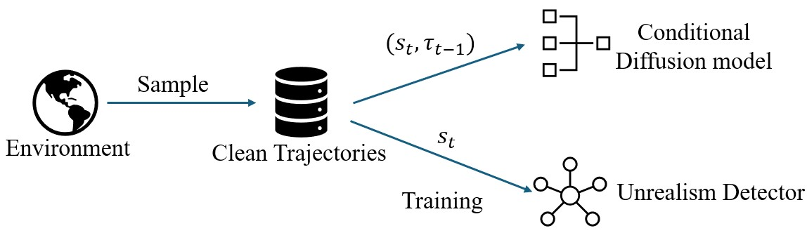
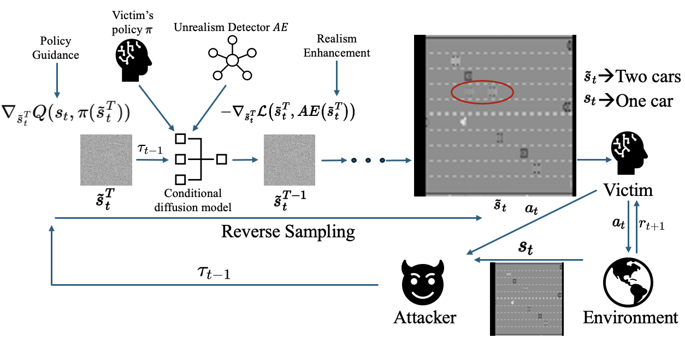

<h1 align="center">
  Official Code for:<br>
  <em>Diffusion Guided Adversarial State Perturbations in Reinforcement Learning</em>
</h1>

<p align="center">
  <strong>Xiaolin Sun</strong>, <strong>Feidi Liu</strong>, <strong>Zhengming Ding</strong>, and <strong>Zizhan Zheng</strong><br>
  <em>NeurIPS 2025</em>
</p>

<p align="center">
  <a href="https://openreview.net/forum?id=Ix4or1zPZw&referrer=%5BAuthor%20Console%5D(%2Fgroup%3Fid%3DNeurIPS.cc%2F2025%2FConference%2FAuthors%23your-submissions)">
    OpenReview
  </a>
</p>


## Introduction

This repository provides the **official implementation of the SHIFT attacks** introduced in our NeurIPS 2025 paper *Diffusion Guided Adversarial State Perturbations in Reinforcement Learning*. SHIFT (**Stealthy History-alIgned diFfusion aTtack**) is a **semantic-aware, policy-agnostic diffusion-based attack** that goes beyond traditional $l_p$-norm constraints. Unlike prior pixel-level perturbations, SHIFT generates **realistic, semantics-changing adversarial states** and remain **stealthy** at the same time.  

Our method introduces two variants:
- **SHIFT-O** — perturbs observations using *true history*, producing semantically altered but trajectory-faithful states.  
- **SHIFT-I** — generates *imagined, self-consistent trajectories* that mislead the agent toward suboptimal actions.  

Comprehensive experiments demonstrate that SHIFT effectively breaks all existing defenses—including diffusion-based ones—while maintaining superior realism and stealthiness across various environments.

## Attack Pipeline 
### Training Stage 

During the training stage, our attacker will collect clean trajectories in order to train a conditional diffusion model and an auto-encoder based realism detector. 



### Testing Stage

During testing, the attacker uses the pretrained history-conditioned diffusion model together with the realism autoencoder to generate and inject history-aligned adversarial observations in real time, guided by the victim’s policy to steer samples toward low-value actions.  

**SHIFT-I** conditions on the *perturbed* trajectory (with the last action dropped) to produce a self-consistent imagined trajectory, while **SHIFT-O** conditions on the *true* states and actions to produce more trajectory-faithful perturbed states.




## Demo
- SHIFT‑I
  
  

- SHIFT-O
  
  

- True States
  
  

### Main Results

|  | **Pong** |  |  |  | **Freeway** |  |  |  |
|:---:|:---:|:---:|:---:|:---:|:---:|:---:|:---:|:---:|
| Model | SHIFT-O-1.0 | SHIFT-O-0.25 | SHIFT-I-1.0 | SHIFT-I-0.25 | SHIFT-O-1.0 | SHIFT-O-0.25 | SHIFT-I-1.0 | SHIFT-I-0.25 |
| DQN-No Attack | 21.0±0.0 | 21.0±0.0 | 21.0±0.0 | 21.0±0.0 | 34.1±0.1 | 34.1±0.1 | 34.1±0.1 | 34.1±0.1 |
| DQN | -21.0±0.0 | -20.8±0.4 | -21.0±0.0 | -21.0±0.0 | 1.2±0.8 | 19.6±2.1 | 12.2±6.3 | 6.2±1.9 |
| SA-DQN | -21.0±0.0 | -20.8±0.4 | -20.8±0.4 | -21.0±0.0 | 19.4±3.0 | 27.6±0.5 | 19.4±1.5 | 19.6±2.2 |
| WocaR-DQN | -21.0±0.0 | -21.0±0.0 | -21.0±0.0 | -21.0±0.0 | 20.2±0.8 | 26.8±1.3 | 20.2±1.3 | 20.8±0.4 |
| CAR-DQN | -20.8±0.4 | -20.0±0.7 | -21.0±0.0 | -21.0±0.0 | 10.2±1.3 | 20.8±0.8 | 15.0±1.0 | 17.2±1.9 |
| DP-DQN | -20.6±0.5 | -9.2±4.5 | -21.0±0.0 | -21.0±0.0 | 21.8±3.2 | 28.0±1.2 | 10.6±2.5 | 7.4±1.3 |
| DMBP | -14.0±4.9 | -9.8±4.5 | -20.6±0.9 | -20.2±0.8 | 22.0±0.7 | 31.0±1.2 | 19.2±2.9 | 14.6±2.5 |
|  | **Doom** |  |  |  | **Airsim** |  |  |  |
| Model | SHIFT-O-1.0 | SHIFT-O-0.25 | SHIFT-I-1.0 | SHIFT-I-0.25 | SHIFT-O-1.0 | SHIFT-O-0.25 | SHIFT-I-1.0 | SHIFT-I-0.25 |
| DQN-No Attack | 75.4±4.4 | 75.4±4.4 | 75.4±4.4 | 75.4±4.4 | 40.3±0.5 | 40.3±0.5 | 40.3±0.5 | 40.3±0.5 |
| DQN | -354.0±8.2 | 55.0±14.1 | -318.0±29.7 | -326.0±20.4 | 9.8±2.3 | 20.8±11.0 | 6.2±0.1 | 10.0±2.9 |
| SA-DQN | -375.0±13.2 | 62.2±4.6 | -337.0±43.1 | -30.8±206.4 | 5.4±0.4 | 6.7±1.6 | 3.7±0.5 | 8.6±2.5 |
| WocaR-DQN | -299.6±143.6 | -38.4±202.3 | -310.0±6.1 | -289.4±173.1 | 5.2±5.0 | 20.7±17.5 | 5.1±4.2 | 7.5±3.9 |
| CAR-DQN | -335.0±15.8 | 61.4±15.5 | -336.0±33.1 | -19.6±190.4 | 0.9±0.3 | 20.7±6.6 | 0.6±0.1 | 3.9±6.5 |
| DP-DQN | -116.4±173.2 | 64.0±10.6 | -303.0±2.7 | -252.0±172.9 | 18.8±2.3 | 17.8±8.8 | 4.8±3.1 | 10.5±3.6 |
| DMBP | -184.8±231.7 | 65.4±9.8 | -302.0±2.7 | -256.2±180.4 | 20.8±12.0 | 22.8±8.0 | 6.2±0.7 | 9.4±4.9 |

The table above presents the performance of **SHIFT-O** and **SHIFT-I** under attack frequencies of 1.0 and 0.25 against various defense mechanisms. Both variants substantially reduce the performance of victim agents—even under strong regularization-based defenses—and remain effective at low attack frequencies. Although diffusion-based defenses such as **DP-DQN** and **DMBP** perform better than previous baselines due to their history-conditioned denoising, our SHIFT attacks still cause significant reward degradation.  


## Environment

- Create a fresh environment and install dependencies:
  - `pip install -r requirements.txt`

## Quick Start
- Train the conditional diffusion world model
  1) Choose an environment in `config/env/atari.yaml` (e.g., `FreewayNoFrameskip-v4`, `PongNoFrameskip-v4`).
  2) Ensure a reference policy is loaded in `src/trainer.py` (`self.policy = model_setup(...)` and optional `load_state_dict` lines for your pre-trained weights).
  3) Run: `python src/main.py`

- Train the autoencoder detector
  1) Set the image folder path in `autoencoder_atari.py` (default `'/freeway_pic_traj'`).
  2) Run: `python autoencoder_atari.py`
  3) Reconstructions in `./test_pic/`, checkpoints in `./ae/`.

- Evaluate and run attacks (SHIFT‑I / SHIFT‑O)
  - Command:
    - `python src/test_ours.py --model <defense> --env <env_id> --attack_rate <0..1> --attack <imagine|real>`
  - Examples:
    - `python src/test_ours.py --model natural --env FreewayNoFrameskip-v4 --attack_rate 0.15 --attack imagine`  # SHIFT‑I
    - `python src/test_ours.py --model natural --env PongNoFrameskip-v4 --attack_rate 0.15 --attack real`        # SHIFT‑O
  - Supported defenses seen in code: `natural`, `sa-dqn-pgd`, `sa-dqn-convex`, `wocar`, `car-dqn-pgd`, `diffusion_history`, `dp-dqn`, `dp-dqn-history`.
  - Important paths: `src/test_ours.py` expects pre-trained weights under `src/pre_trained/`

## Configuration
- Main trainer config: `config/trainer.yaml`
  - World-model horizon, denoising steps, training schedule, checkpoint cadence.
- Environment config: `config/env/atari.yaml`
  - `train.id` / `test.id`, frame size, life-loss behavior.
- Agent/model config: `config/agent/default.yaml`
  - Denoiser architecture, conditioning, auxiliary heads.
- Hydra behavior
  - Each run saves to `outputs/YYYY-MM-DD/HH-MM-SS/` with `checkpoints/`, `dataset/`, and a resolved `config/trainer.yaml` plus a copy of `src/` and `scripts/`.


## Data
- To generate clean trajectories that used to train the author-encoder, run `python src/gen_atari_pic.py`

## Outputs & Checkpoints
- Conditional Diffusion Model: `outputs/<date>/<time>/checkpoints/`
  - `state.pt` stores training state; periodic agent copies are kept per `checkpointing.save_agent_every`.
  - Use `utils.get_path_agent_ckpt(<checkpoints_dir>, epoch=-1)` to resolve the latest.
- Autoencoder: saved to `./ae/` by `autoencoder_atari.py:1`.

## Paper & Citation
- Paper: https://openreview.net/forum?id=Ix4or1zPZw&referrer=%5BAuthor%20Console%5D(%2Fgroup%3Fid%3DNeurIPS.cc%2F2025%2FConference%2FAuthors%23your-submissions)
- Please cite our paper if you use this code:

```
@inproceedings{
sun2025diffusion,
title={Diffusion Guided Adversarial State Perturbations in Reinforcement Learning},
author={Xiaolin Sun and Feidi Liu and Zhengming Ding and Zizhan Zheng},
booktitle={The Thirty-ninth Annual Conference on Neural Information Processing Systems},
year={2025},
url={https://openreview.net/forum?id=Ix4or1zPZw}
}
```

### License
This project is licensed under the [MIT License](LICENSE).


### Contact
- <xsun12@tulane.edu> (Xiaolin Sun) — for questions about code and experiments.
